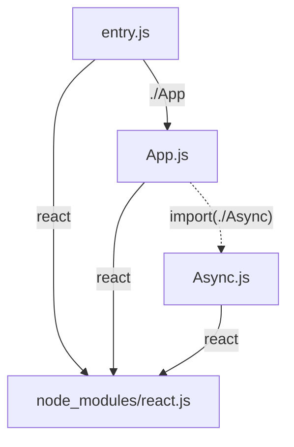
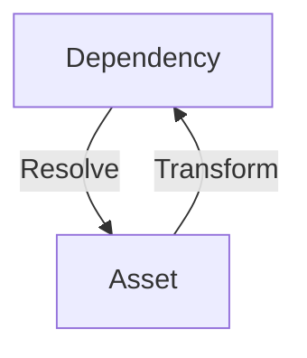
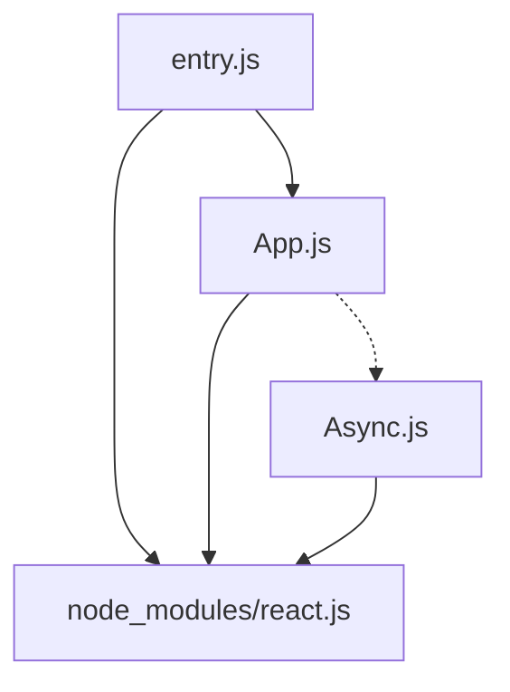
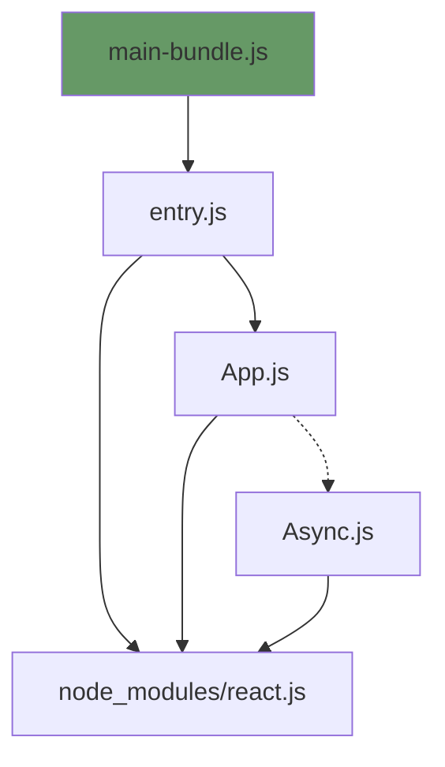
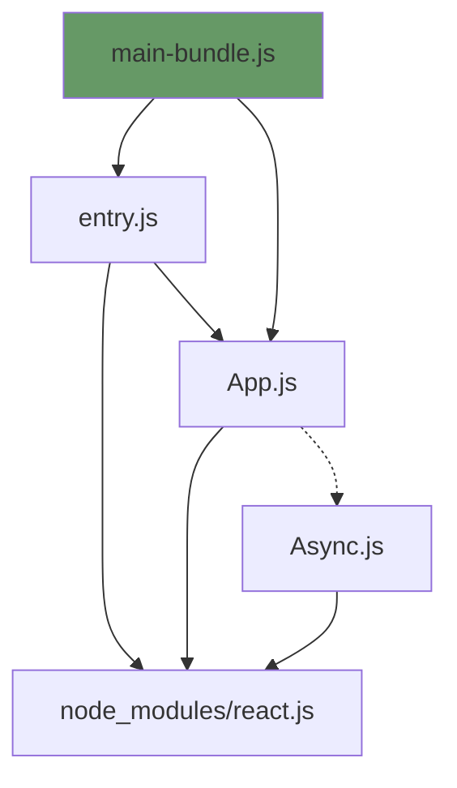
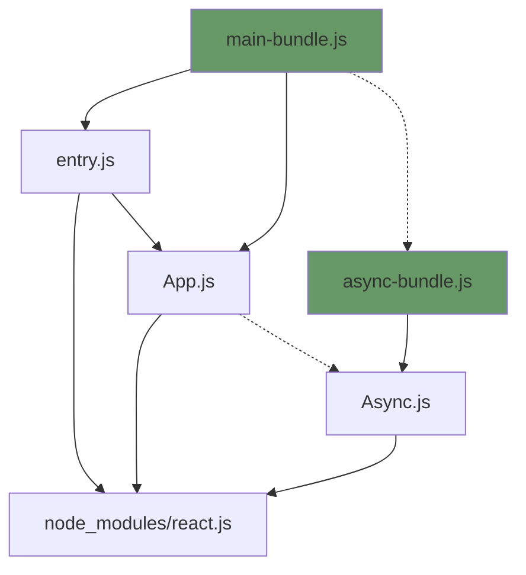
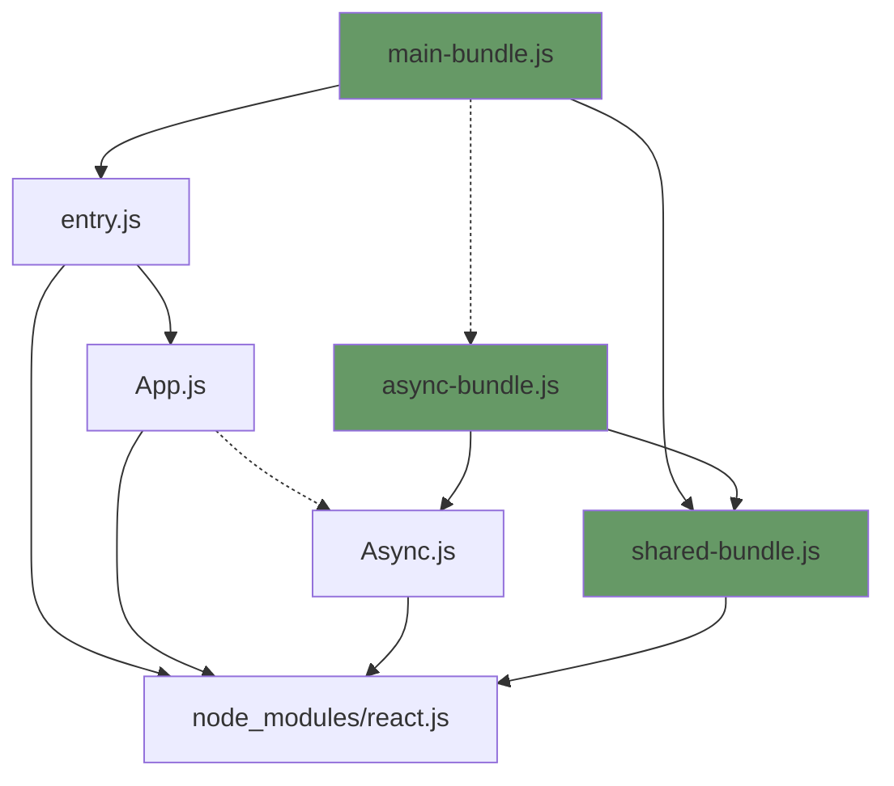

# Intro to bundling

Breaking one app into thousands of chunks

---
layout: cover
---

# About me

- Matt Jones
- App framework - bundler team
- Working on Atlaspack

---
layout: center
---

# Atlaspack

<!--
- Why fork?
- Specific to Atlaspack, the ideas are mostly the same across different bundlers
-->

---
layout: center
---

<div class="flex justify-center gap-50">

<span class="m-auto">

# 3 Phases

</span>

<div class="flex flex-col gap-10">

## Building

## Bundling

## Packaging

</div>

</div>

---
layout: center
---

# Building

Creating the `AssetGraph`

---



---
layout: two-cols
layoutClass: "gap-10"
class: "self-center"
---

## Transform

Takes an Asset and:

- Extracts it Dependencies
- Modifies the code to suit the target environment

## Resolve

Takes a Dependency and returns an Asset, which is either an:

- Absolute file path
- Code stored in memory

::right::



---
layout: "center"
---

# What is a transformer?

---
layout: "two-cols"
layoutClass: "gap-10"
class: "self-center"
---

```tsx {all|2,5|4|17-20}
// App.js
import React, { useState } from "react";

async function askAI(question: string) {
  const ai = await import("./async");
  const answer = await ai(question);

  alert(answer);
}

export function App() {
  const [question, setQuestion] = useState();
  const onClick = () => askAI(question);
  const onChange = (v) => setQuestion(v);

  return (
    <div>
      <input value={question} onChange={onChange} />
      <button onClick={onClick}>Ask AI</button>
    </div>
  );
}
```

::right::

<v-clicks at="1">

- Extract the `react` and `./async` imports
- Strip out types
- Replace JSX syntax with the React JSX runtime

</v-clicks>

---
layout: two-cols
layoutClass: "align-center gap-10"
class: "gap-10"
---

# Source code

```js
import { useState } from "react";
```

::right::

# AST

```json {all|4-11|7-8|13-16|14-15}
{
  "type": "ImportDeclaration",
  "specifiers": [
    {
      "type": "ImportSpecifier",
      "local": {
        "type": "Identifier",
        "value": "useState"
      },
      "isTypeOnly": false
    }
  ],
  "source": {
    "type": "StringLiteral",
    "value": "react"
  },
  "typeOnly": false,
  "asserts": null
}
```

---
layout: "two-cols"
layoutClass: "gap-2"
---

# Source code

```tsx {all|1|4|3|16-19|all}{at:1}
import React, { useState } from "react";

async function askAI(question: string) {
  const ai = await import("./async");
  const answer = await ai(question);

  alert(answer);
}

export function App() {
  const [question, setQuestion] = useState();
  const onClick = () => askAI(question);
  const onChange = (v) => setQuestion(v);

  return (
    <div>
      <input value={question} onChange={onChange} />
      <button onClick={onClick}>Ask AI</button>
    </div>
  );
}
```

::right::

# Transformed code

```js {all|1-2|4|3|12-25|all}{maxHeight:'393px',at:1}
var _react = require("react");
var _reactDefault = atlaspackHelpers.interopDefault(_react);
async function askAI(question) {
  const ai = await require("dd327547f2991049");
  const answer = await ai(question);
  alert(answer);
}
function App() {
  const [question, setQuestion] = (0, _react.useState)();
  const onClick = () => askAI(question);
  const onChange = (v) => setQuestion(v);
  return /*#__PURE__*/ (0, _reactDefault.default).createElement(
    "div",
    null,
    /*#__PURE__*/ (0, _reactDefault.default).createElement("input", {
      value: question,
      onChange: onChange,
    }),
    /*#__PURE__*/ (0, _reactDefault.default).createElement(
      "button",
      {
        onClick: onClick,
      },
      "Ask AI",
    ),
  );
}
```

---
layout: "two-cols"
layoutClass: "items-center"
---

# Transform pipeline

An ordered list of transformers that take turns modifying the Asset

::right::

```json
{
  "transformers": {
    "*.{js,mjs,jsx,cjs,ts,tsx}": [
      "transformer-react-loosely-lazy",
      "transformer-babel",
      "@atlaspack/transformer-js"
    ]
  }
}
```

---

# Dependencies

<div class="flex h-full gap-10">

<div class="w-1/2">

```js
import React, { useState } from "react";
```

</div>

<div class="w-1/2">

```js
asset.addDependency({
  specifier: "react",
  from: "App.js",
  priority: "sync",
});
```

</div>

</div>

---

# Dependencies

<div class="flex h-full gap-10">

<div class="w-1/2">

```js
import("./async");
```

</div>

<div class="w-1/2">

```js
asset.addDependency({
  specifier: "./async",
  from: "App.js",
  priority: "lazy",
});
```

</div>

</div>

---


---
layout: "center"
---

# Bundling

Turning the `AssetGraph` into a `BundleGraph`

---



---



---



---



---



---
layout: "center"
---

# Packaging

---
layout: "center"
---

<div class="flex flex-col justify-center h-full gap-10">

```js
// entry.js
import { log } from "./logger";

log("My app");
```

```js
// logger.js
export function log(value) {
  console.log(value);
}
```

</div>

---

```js {all|25-81|137-143|139,142|142,144|144-154}{maxHeight:'450px'}
(function (modules, entry, mainEntry, parcelRequireName, globalName) {
  var globalObject =
    typeof globalThis !== "undefined"
      ? globalThis
      : typeof self !== "undefined"
        ? self
        : typeof window !== "undefined"
          ? window
          : typeof global !== "undefined"
            ? global
            : {};

  // Save the require from previous bundle to this closure if any
  var previousRequire =
    typeof globalObject[parcelRequireName] === "function" &&
    globalObject[parcelRequireName];

  var cache = previousRequire.cache || {};
  // Do not use `require` to prevent Webpack from trying to bundle this call
  var nodeRequire =
    typeof module !== "undefined" &&
    typeof module.require === "function" &&
    module.require.bind(module);

  function newRequire(name, jumped) {
    if (!cache[name]) {
      if (!modules[name]) {
        // if we cannot find the module within our internal map or
        // cache jump to the current global require ie. the last bundle
        // that was added to the page.
        var currentRequire =
          typeof globalObject[parcelRequireName] === "function" &&
          globalObject[parcelRequireName];
        if (!jumped && currentRequire) {
          return currentRequire(name, true);
        }

        // If there are other bundles on this page the require from the
        // previous one is saved to 'previousRequire'. Repeat this as
        // many times as there are bundles until the module is found or
        // we exhaust the require chain.
        if (previousRequire) {
          return previousRequire(name, true);
        }

        // Try the node require function if it exists.
        if (nodeRequire && typeof name === "string") {
          return nodeRequire(name);
        }

        var err = new Error("Cannot find module '" + name + "'");
        err.code = "MODULE_NOT_FOUND";
        throw err;
      }

      localRequire.resolve = resolve;
      localRequire.cache = {};

      var module = (cache[name] = new newRequire.Module(name));

      modules[name][0].call(
        module.exports,
        localRequire,
        module,
        module.exports,
        globalObject,
      );
    }

    return cache[name].exports;

    function localRequire(x) {
      var res = localRequire.resolve(x);
      return res === false ? {} : newRequire(res);
    }

    function resolve(x) {
      var id = modules[name][1][x];
      return id != null ? id : x;
    }
  }

  function Module(moduleName) {
    this.id = moduleName;
    this.bundle = newRequire;
    this.exports = {};
  }

  newRequire.isParcelRequire = true;
  newRequire.Module = Module;
  newRequire.modules = modules;
  newRequire.cache = cache;
  newRequire.parent = previousRequire;
  newRequire.register = function (id, exports) {
    modules[id] = [
      function (require, module) {
        module.exports = exports;
      },
      {},
    ];
  };

  Object.defineProperty(newRequire, "root", {
    get: function () {
      return globalObject[parcelRequireName];
    },
  });

  globalObject[parcelRequireName] = newRequire;

  for (var i = 0; i < entry.length; i++) {
    newRequire(entry[i]);
  }

  if (mainEntry) {
    // Expose entry point to Node, AMD or browser globals
    // Based on https://github.com/ForbesLindesay/umd/blob/master/template.js
    var mainExports = newRequire(mainEntry);

    // CommonJS
    if (typeof exports === "object" && typeof module !== "undefined") {
      module.exports = mainExports;

      // RequireJS
    } else if (typeof define === "function" && define.amd) {
      define(function () {
        return mainExports;
      });

      // <script>
    } else if (globalName) {
      this[globalName] = mainExports;
    }
  }
})(
  {
    QE77E: [
      function (require, module, exports, __globalThis) {
        var _logger = require("./logger");
        (0, _logger.log)("My app");
      },
      { "./logger": "2wZan" },
    ],
    "2wZan": [
      function (require, module, exports, __globalThis) {
        var atlaspackHelpers = require("@atlaspack/transformer-js/src/esmodule-helpers.js");
        atlaspackHelpers.defineInteropFlag(exports);
        atlaspackHelpers.export(exports, "log", () => log);
        function log(value) {
          console.log(value);
        }
      },
      { "@atlaspack/transformer-js/src/esmodule-helpers.js": "5E4U9" },
    ],
    "5E4U9": [
      function (require, module, exports, __globalThis) {
        exports.interopDefault = function (a) {
          return a && a.__esModule
            ? a
            : {
                default: a,
              };
        };
        exports.defineInteropFlag = function (a) {
          Object.defineProperty(a, "__esModule", {
            value: true,
          });
        };
        exports.exportAll = function (source, dest) {
          Object.keys(source).forEach(function (key) {
            if (
              key === "default" ||
              key === "__esModule" ||
              Object.prototype.hasOwnProperty.call(dest, key)
            )
              return;
            Object.defineProperty(dest, key, {
              enumerable: true,
              get: function () {
                return source[key];
              },
            });
          });
          return dest;
        };
        exports.export = function (dest, destName, get) {
          Object.defineProperty(dest, destName, {
            enumerable: true,
            get: get,
          });
        };
      },
      {},
    ],
  },
  ["QE77E"],
  "QE77E",
  "parcelRequire94c2",
);
```

---
layout: "center"
---

# Scope hoisting

---

<div class="flex flex-col justify-center h-full gap-20">

```js
(() => {
  function $57b745d1d9cffb89$export$bef1f36f5486a6a3(value) {
    console.log(value);
  }

  (0, $57b745d1d9cffb89$export$bef1f36f5486a6a3)("My app");
})();
```

<v-click>

```js
console.log("My app");
```

</v-click>

</div>

---
layout: "center"
---

# Dynamic imports?

---
layout: "center"
---

<div class="flex flex-col justify-center h-full gap-10">

```js
// entry.js
const { log } = await import("./logger");

log("My app");
```

```js
// logger.js
export function log(value) {
  console.log(value);
}
```

</div>

---

<div class="flex flex-col justify-center h-full gap-10">

```js {all|7|2-5|3|4|7|all}{at:1}
// entry-bundle.js
var $63d67f$exports = {};
$63d67f$exports = import("./logger-bundle.js").then(() =>
  parcelRequire("37vq4"),
);

const { log: $af6c0$var$log } = await $63d67f$exports;
$af6c0$var$log("My app");
```

```js {all|none|none|all|2|3|all}{at:1}
// logger-bundle.js
parcelRegister("37vq4", function (module, exports) {
  $parcel$export(module.exports, "log", () => $245a6$export$bef1f);

  function $245a6$export$bef1f(value) {
    console.log(value);
  }
});
```

</div>

---
layout: center
---

# Thanks for listening
